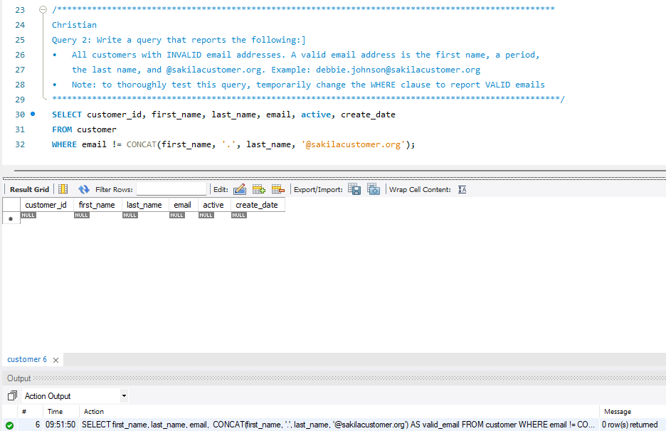

# MySQL_Chapter3

<b>Table of Content</b>
- [Summary](#summary)
- [Workers](#workers)
- [New Concepts Used](#new-concepts-used)
- [Browser Output Example](#browser-output-example)

## Summary
This is a Dynamic Web Page.
- Display information from a Database
- Learn how to code a dynamic web page
- Adding columns to a web page

## Workers
[@28cyager](https://github.com/28cyager) Christian Yager

[jacobczapla](https://github.com/jacobczapla) Jacob Czapla

## New Concepts Used
- Dynamic Web Pages
- Working with PHP files
- MySQL Database

## Browser Output Example

[Back to Top](#single-query)
